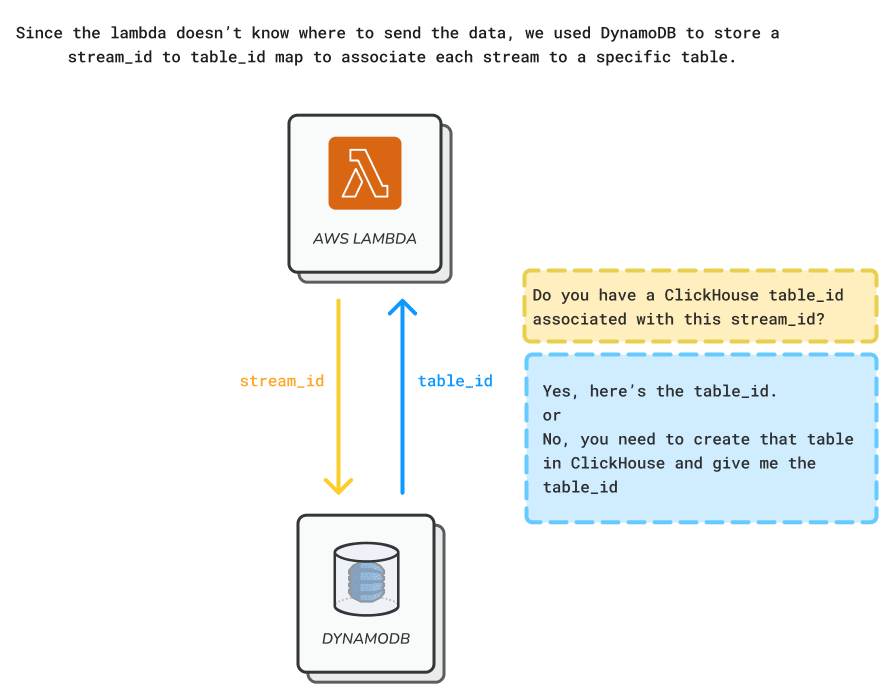

# Helios Architecture

To meet the requirements of Amazon Kinesis users looking to explore and analyze their event streams, Helios is built around three key components:

<Icon name="CircleStackIcon" /><strong>Storage</strong> - A database optimized for querying streaming data, specifically an Online Analytical Processing (OLAP) database capable of handling high-volume, real-time data ingestion, and delivering fast query performance for analytical workloads.

<Icon name="LinkIcon" /><strong>Connection</strong> - An ingestion mechanism to efficiently transfer events from Kinesis streams into our chosen database.

<Icon name="WindowIcon" /><strong>Interface</strong> - A user-friendly graphical interface allowing users to conduct analyses and visualize results.

Given that potential Helios users are already leveraging Amazon Kinesis, it made sense to host all of Helios' infrastructure within the AWS ecosystem.

In the following section, we will dive into the specific services we chose, explaining how each component contributes to Helios' functionality and performance.

Our design decisions and their associated tradeoffs will be explored in the “Building Helios: Design Choices” section of the case study, while this section is focused on how we architected Helios.

## Storage

Tying back to our example use case of e-commerce user analytics, we required a database optimized for analytical queries. A typical analytical query might ask, "What is the average order value for customers who used a discount code in the past hour?" Such queries demand specific capabilities from our database.

As defined in "Designing Data-Intensive Applications" (DDIA), analytical queries typically scan millions of records, reading only a few columns per record, and calculate aggregate statistics rather than returning raw data. This definition guided our approach to storage architecture.

Databases typically fall into two categories: **Online Analytical Processing (OLAP)** and **Online Transaction Processing (OLTP)**, each optimized for distinct use cases. **OLAP** systems, primarily used for analytics, are designed to process millions of records per query. In contrast, **OLTP** systems typically process small numbers of records per query using keys and indexes for quick data retrieval. The fundamental difference lies in their access patterns: OLTP prioritizes small-scale transactions, while OLAP focuses on large-scale data analysis.

Ultimately, we chose ClickHouse as our OLAP database to power Helios' analytical capabilities. [Later](./building-helios.md#choosing-a-database) in this case study, we will provide a detailed exploration of our database selection process, including the factors that influenced our decision.

The following diagram illustrates our storage architecture:

### ClickHouse Database Server

The main functions of the ClickHouse database are to store event data consumed from Kinesis streams and to make this data available for querying. The database is deployed on an Amazon EC2 instance (i.e. virtual server).

With storage in place, the next phase of our architecture design was to implement an integration between a user’s Amazon Kinesis streams and the ClickHouse instance.

## Connection

Efficiently transferring events from Kinesis streams to our ClickHouse database presented a challenge. We needed a solution that could handle high-volume data ingestion, perform necessary decoding, and ensure reliable delivery.

To address this, we developed a custom AWS Lambda function as our stream processor. This approach allows us to:

<Icon name="DocumentMagnifyingGlassIcon" />Decode and parse Kinesis event data

<Icon name="ExclamationTriangleIcon" /> Implement custom error handling

<Icon name="TableCellsIcon" /> Dynamically map data to appropriate ClickHouse tables

<Icon name="ArrowDownOnSquareIcon" /> Perform efficient inserts

By leveraging Lambda, we created a flexible and scalable solution tailored to our specific data processing needs. Let's explore how this custom processor works in detail.

###

### Kinesis to ClickHouse Integration

Helios’ Lambda Processor is an AWS serverless function that serves as a connector between Amazon Kinesis event streams and ClickHouse tables. The Lambda’s main roles are to decode the events from the Kinesis stream and insert them into the ClickHouse database. The full process involves retrieving table information, preparing data for batch insertion, and attempting to insert the data into ClickHouse.

Using an event-based trigger, the function ingests <TippyWrapper content="In Amazon Kinesis, this is formally called a 'record'. However, for consistency and clarity in our discussion, we will continue to refer to it as an 'event' throughout this case study.">event data</TippyWrapper> from AWS Kinesis streams, and decodes the Kinesis event payload into a JSON object.

Once the Lambda decodes the payload from a stream, the data needs to be sent to the associated destination table within Clickhouse. To retrieve the table ID, the Lambda interacts with a key-value database, DynamoDB, which contains a mapping of stream IDs to table IDs.

In the DynamoDB table we associate one AWS Kinesis stream to one Clickhouse table. This not only eliminates potential schema errors when ingesting data from multiple streams, but also prevents human error if users try to connect multiple streams to one table.

While the storage and connection components form the backbone of Helios, the analysis layer serves as the user-facing interface, bridging the gap between raw data and actionable insights.

## Interface

### Application Server

The Helios web application, hosted on an Amazon EC2 instance, serves as the primary interface for users. Implemented with a Flask backend and a React frontend, its core features include:

<Icon name="CommandLineIcon" />An interactive SQL console for querying data from event streams, enabling real-time data analysis

<Icon name="LinkIcon" />An interface for connecting a data source, such as a Kinesis stream, to the Helios architecture

Now that you have a good understanding of how Helios works, in the next section we will cover why we designed it in this way as well as the trade-offs made throughout the building of Helios. Here is our architecture so far:

