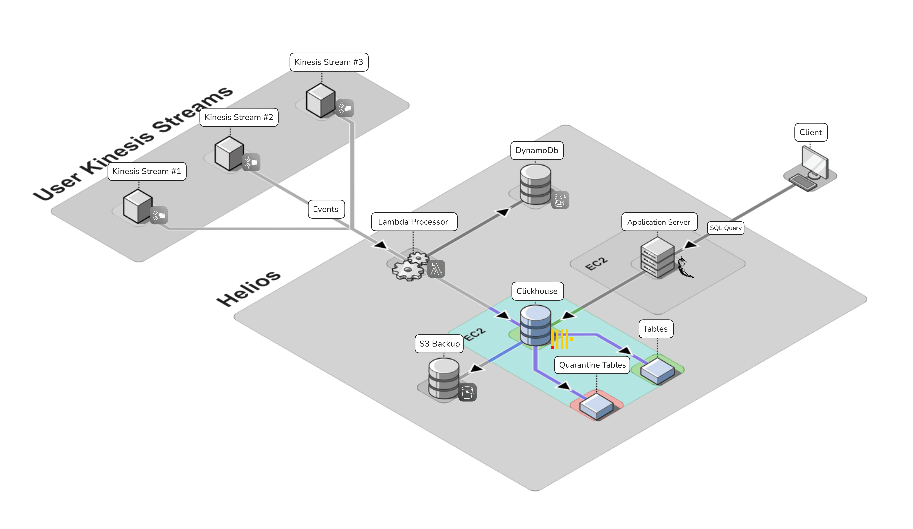
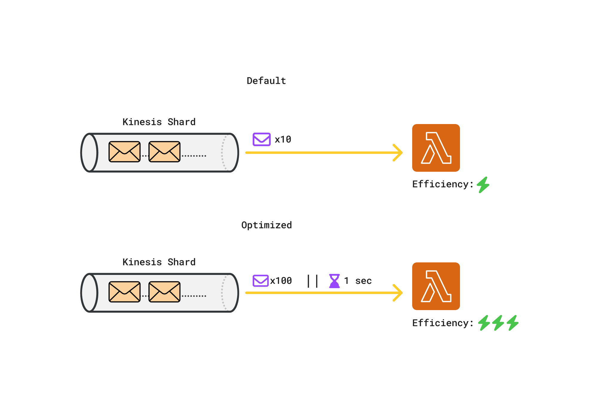
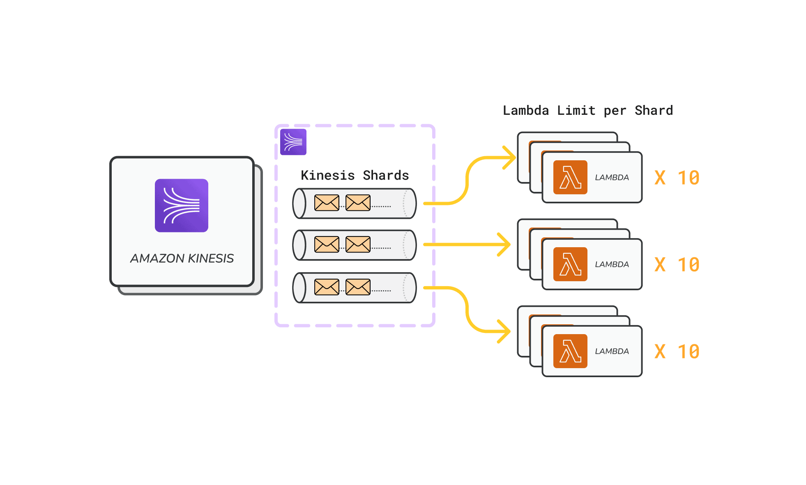
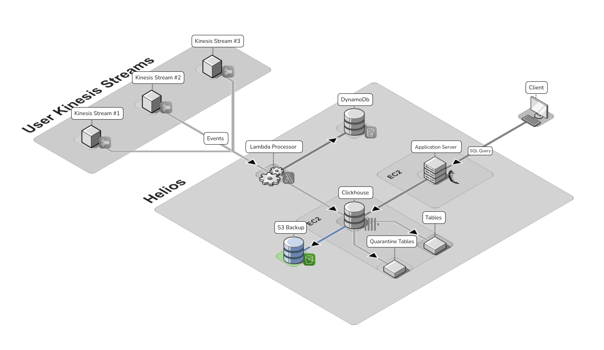
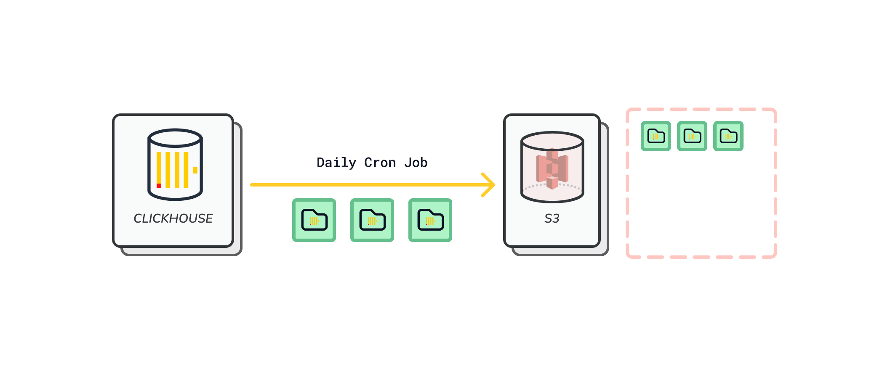
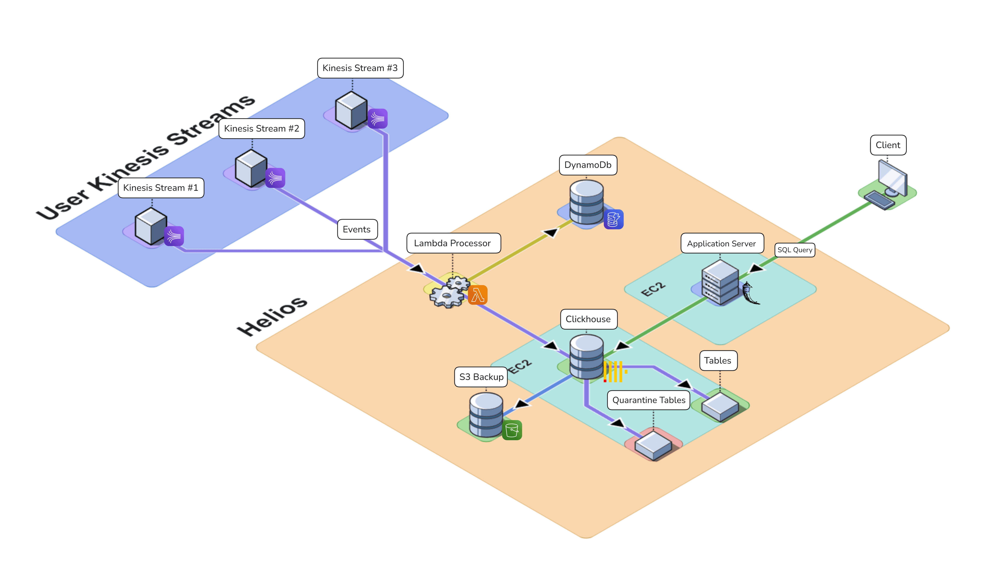

# Improving Core Platform

Below we detail the problems we encountered and the solutions we implemented to improve upon our core platform.

## Quarantine Tables

The initial version of Helios lacked error handling for failed database insertion of event records within the Lambda connector, potentially leading to data loss and difficult to parse error messages. To mitigate these issues and enhance system reliability, we implemented a comprehensive error handling and data quarantine system. Below, we outline the key features of this new system:

<Icon name="ExclamationCircleIcon"/><strong>Error Identification</strong>: The Lambda now includes logic to identify various types of errors, including schema mismatches and insertion failures.

<Icon name="TagIcon"/><strong>Error Categorization</strong>: Each error is then categorized by type and summarized with a concise abstract, providing clear insight into the nature of data quality issues.

<Icon name="ArchiveBoxIcon"/><strong>Data Preservation</strong>: The data that fails to insert into the main table is then stored in a separate quarantine table along with the error summary details. This ensures no data loss and allows users to quickly examine the exact records that failed to insert.

<Icon name="SparklesIcon"/><strong>AI Summary</strong>: For users who provide a ChatGPT AI key during deployment, we've integrated an AI-powered feature to enhance the error analysis process. This feature leverages a custom ChatGPT system prompt to summarize and interpret the errors stored in the quarantine table, significantly aiding users in their debugging efforts.

\[Image of quarantine table \- needs css done first\]

These enhancements collectively improve Helios’ error handling, while providing tools for error analysis and resolution.

## Lambda Optimization

To improve Helios' performance and efficiency, we implemented several optimizations to the Lambda connector. These enhancements focus on data processing, concurrency, and resource utilization, aiming to increase throughput and reduce costs while maintaining real-time capabilities.

### Batching and Batch Window

Our initial Connector function processed Kinesis records in small batches of 10\. We optimized this by increasing the maximum batch size to 100 records and setting a batch window of one second.

This change significantly reduces Lambda invocations, leading to less overhead and improved cost efficiency. Larger batches also enhance overall throughput and make better use of allocated resources. The one-second window ensures a balance between efficiency and near real-time processing, as records are sent when either the batch size is reached or the time window expires.

These optimizations improve system performance while reducing costs for users, all while maintaining Clickhouse's real-time update capabilities.

### Parallelization

Parallelization in the context of Lambdas means that multiple Lambda instances can be run at the same time. By default, the Lambda parallelization factor is set to 1\. This means that only one Lambda instance can be a trigger for one Kinesis <TippyWrapper content="A shard is a unit of capacity within a Kinesis stream that provides a fixed amount of data throughput and serves as a partition for organizing events.">shard</TippyWrapper>. We adjusted this setting to 10, allowing up to ten Lambda instances to process data from a single Kinesis shard simultaneously. This significantly improves our ingestion capacity and scalability, increasing our system's ability to handle high-volume data streams quickly and efficiently.

### Caching DynamoDB requests

Recall from earlier that Lambdas have to send a request to the DynamoDB to get the table UUID for the Clickhouse table destination. To reduce unnecessary DynamoDB calls for the Clickhouse table UUID, we moved the DynamoDB client initialization to the global scope of our Lambda function.

Our caching strategy ensures that subsequent invocations of the same Lambda instance will reuse the existing client and table UUID information. This approach reduces DynamoDB calls from executing for each record in the batch. For example, if the batch size is 100 records, 1 Dynamo request will be sent rather than 100 \- since we already have our table UUID information cached. Additionally, further calls are not made if the same Lambda instance is invoked.

## Database Backups

In the first iteration of Helios, the ClickHouse database lacked backup capabilities. For instance, if the EC2 went down, our data would not be recoverable. Addressing this vulnerability was a critical improvement for version two.

As part of our backup strategy, we integrated an Amazon S3 (Simple Storage Service) bucket into our AWS-based architecture. This addition plays a crucial role in enhancing our data resilience and disaster recovery capabilities for our ClickHouse database running on an EC2 instance. The S3 bucket serves as a highly durable and scalable object storage solution, allowing us to implement daily backups of the ClickHouse database efficiently. By leveraging S3's virtually unlimited storage capacity and 99.999999999% (11 9's) of durability, we ensure that our critical data is preserved securely over the long term.

The backup cron job process is automated to run daily, capturing a full snapshot of the ClickHouse database and transferring it to the designated S3 bucket.

## Export to CSV

The underlying goal for developing Helios is to provide Amazon Kinesis customers with a simple, cost-effective way to analyze their streaming events. While our interactive SQL console serves as the core feature for this analysis, we recognize the need for users to easily extract, run further analysis and share their query results.

To address this, we implemented a feature allowing users to download the results of any SQL query as a CSV file. This functionality enables information sharing and integration with other tools in users' data analysis workflows.

Future enhancements are planned to further expand the utility of query results for Helios users. These improvements will aim to provide even more flexibility in how users can leverage their SQL query results. Please refer to the [Future Work](./future-work.md) section below for more details on upcoming features.

---

To summarize our core platform improvements, we bolstered the platform with features including quarantine tables, Lambda optimizations, S3 backups, and CSV exports. These enhancements to Helios have improved our system resilience, error handling, and overall performance.

After the above improvements, our final architecture looks like this:

