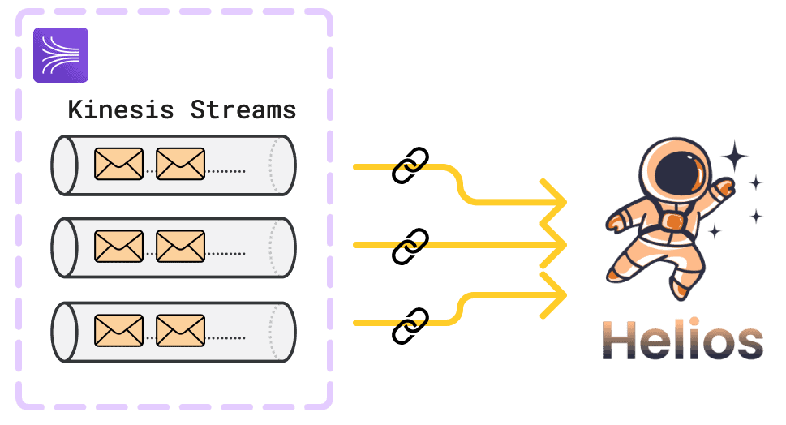

# Introduction

Helios is an open-source platform designed to simplify the visualization and analysis of real-time event streams by exposing data for SQL querying. Our automated deployment process and intuitive interface allow teams to query and gain insights from their existing event streams.

In this case study, we will describe why we built Helios, the architecture and specific trade-offs made, technical challenges we encountered and improvements we made along the way.

## Problem Domain

In today's data-driven landscape, teams increasingly rely on real-time event streams to gain insights and drive decision-making. However, the sheer volume and velocity of these streams often present significant challenges for extracting meaningful information, including viewing raw event data, performing ad-hoc analysis, and debugging events in real-time. These difficulties are particularly pronounced when using popular event streaming platforms like Amazon Kinesis, which offer limited native tools for data exploration and analysis. To fully appreciate the context in which Helios operates and the problems it aims to solve, it's essential to first understand some fundamental concepts related to events and event streaming.

### Fundamental Background

#### Events

An **event** is a state change in a system or application. This could be as simple as a user clicking a button or as complex as a critical system update.

> “\[An event is\] a small, self-contained, immutable object containing the details of something that happened at some point in time … \[it\] might be an action that a user took, such as viewing a page or making a purchase. It might also originate from a machine, such as a periodic measurement from a temperature sensor, or a CPU utilization metric.” \- DDIA

#### Event streaming

**Event streaming** is the continuous transmission and processing of events from various sources in real-time or near real-time. **Real-time** has different meanings depending on the context. For instance, in high-frequency trading, real-time might mean microseconds, whereas in social media analytics, it could mean within a few minutes. In this case study, we define real-time as end-to-end latency within 5 seconds from event consumption by Helios from a streaming platform to event data being available for querying. This definition is based on our load testing, which will be detailed later in this case study.

In event streaming architecture, events are generated by **producers**, for example a web application which produces user click events, and can be processed by multiple **consumers**. A consumer is an entity that receives and processes messages or events from one or more streams. **Brokers** are the intermediary that receives, stores and distributes events (e.g. queues).

##### Event Streaming Platforms

**Event streaming platforms** act like a broker in that they receive events from producers and can have multiple consumers. Popular event streaming platforms include Apache Kafka, Google Pub/Sub, and Amazon Kinesis.

The defining characteristics of event streaming are its real-time nature \- where data is processed as it arrives rather than being stored for later analysis, its continuity \- with data being constantly added to the stream, and its unboundedness \- meaning the total size of the data is unknown and potentially infinite.

##### Event streaming use cases

Event streaming serves a variety of functions, including:

- User analytics \- allowing organizations to gain immediate insights from data as it's generated
- Log aggregation and monitoring \- facilitating rapid identification of system issues and performance bottlenecks
- Security \- powers fraud detection systems, enabling swift responses to suspicious activities
- Transaction processing \- financial institutions leverage event streaming for processing transactions in real-time, ensuring up-to-the-second accuracy in account balances and trade executions

### Event Streaming Platform Limitations

While event streaming platforms excel at ingesting and processing high-volume, real-time data, they present a significant challenge for data analysis and exploration: data accessibility. Event streaming platforms are optimized for throughput and real-time processing, not for ad-hoc querying or historical analysis. This makes it difficult for analysts to explore past data or perform complex analyses on the fly.

This limitation can significantly impact a team's ability to derive timely insights from their streaming data. To illustrate this challenge more concretely, let's consider a common use case in the e-commerce industry.

#### Example: User Analytics in E-commerce

Imagine an e-commerce platform using Amazon Kinesis to stream user behavior data. The platform captures events such as page views, product interactions, and purchases in real-time. The analytics team might want to leverage this data to:

1. Analyze user journeys across sessions
2. Compute real-time conversion rates
3. Detect anomalies in user behavior

However, they face a significant hurdle: data accessibility. While Kinesis efficiently handles the ingestion of these events, it does not provide an easy way for analysts to query this data using familiar tools like SQL. This means that even seemingly simple questions like "What are the top 5 products viewed in the last hour?" become challenging to answer quickly.

The team finds themselves constrained by the limitations of the platform, unable to easily explore the wealth of data at their fingertips. This scenario underscores the need for additional tools that can bridge the gap between the data ingestion capabilities of streaming platforms and the analytical needs of data teams.

Given these challenges with event streams, various platforms exist to improve event visibility and accessibility. Helios is one such tool, focused on enabling real-time exploration and analysis of Amazon Kinesis event streams.

### Third-Party Managed Services

There are a number of <TippyWrapper content="Managed service providers include: Tinybird, ClickHouse Cloud, StarTree, DoubleCloud, Altinity, & Imply">data analytics managed services</TippyWrapper> that help teams access their streaming data for analysis.

For example, Tinybird is a data platform that allows users to explore real-time event streams using SQL and publish API endpoints of the query results to be consumed by user-facing analytics systems. Some of their most well-known customers include Canva and Vercel.

There are similar services including StarTree, which operates in the same space as Tinybird and serves customers including Stripe.

Managed services offer quick setup and powerful features, but come with specific trade-offs.

The main trade-offs of using managed services like Tinybird are vendor lock-in, cost and data ownership. Vendor lock-in can make it difficult and expensive to switch to another provider or bring operations in-house. In terms of cost, while managed services often have higher upfront pricing, they can potentially reduce operational expenses by eliminating the need for in-house infrastructure management and specialized personnel. The total cost of ownership depends on factors such as scaling needs and existing resources. Regarding data ownership, using a managed service means entrusting data storage and management to a third party. This can raise concerns about data control, access, portability, and compliance, although many services offer security measures and options for increased data control.

For teams willing to navigate these trade-offs, managed services can often be a great option, providing scalability and specialized capabilities without the complexity of maintaining a custom infrastructure. If going the managed route, each service comes with its own set of considerations in terms of deployment complexity, underlying database, and integration capabilities.

### DIY Infrastructure

Alternatively, teams opting for a do-it-yourself (DIY) solution would need to develop and maintain their own infrastructure and tooling, mirroring the capabilities offered by managed services such as Tinybird.

The DIY route offers maximum flexibility and control over your data and infrastructure. It allows for deep customization to meet specific needs and can potentially be more cost-effective at large scales. However, it requires in-house expertise in areas such as data engineering and infrastructure management. The initial setup time and ongoing maintenance efforts are also considerably higher compared to managed services.

## How does Helios compare?

Helios provides an alternative option in the landscape of event stream analytics solutions, **particularly for users of Amazon Kinesis**. Our platform aims to address some of the challenges associated with both third-party managed services and DIY approaches.

Helios strives to offer a practical solution for teams looking to analyze their Kinesis data without the full complexity of a DIY setup or the potential costs of third-party managed services.

Helios simplifies the process of exploring and analyzing Amazon Kinesis event data by offering a Kinesis integration, an intuitive SQL-based analysis interface, and automated AWS infrastructure deployment for the Helios application.

At its core, Helios is comprised of:

1. Helios Amazon Kinesis Integration: Links existing Kinesis streams to the Helios infrastructure.
   
2. Helios web application: offers an interface for connecting existing streams to the Helios backend infrastructure and an integrated SQL console querying and analyzing Kinesis event streams.
   

3. Helios CLI: configures Helios deployment with AWS credentials; deploys the entire Helios stack to AWS using a single command; and destroys the stack when needed. We will go into more detail within the Automating Deployment section.

As with any tool, the suitability of Helios depends on each team's specific requirements, existing infrastructure, and resources. We encourage potential users to evaluate how our offering aligns with their particular needs and constraints.

### Comparison Table

To summarize, teams have numerous options for viewing and analyzing events within Kinesis streams. There is no one-size-fits-all solution. The choices can be broadly categorized into three main options: DIY, paid 3rd-party services, and open-source solutions (including Helios).

Each option offers distinct advantages and limitations, making it crucial for teams to carefully evaluate their specific requirements before selecting the most suitable approach.

Having explored the problem space and current solutions, we will now dive into Helios' internal workings. The upcoming section will break down our architecture, examining how each component functions in detail.
