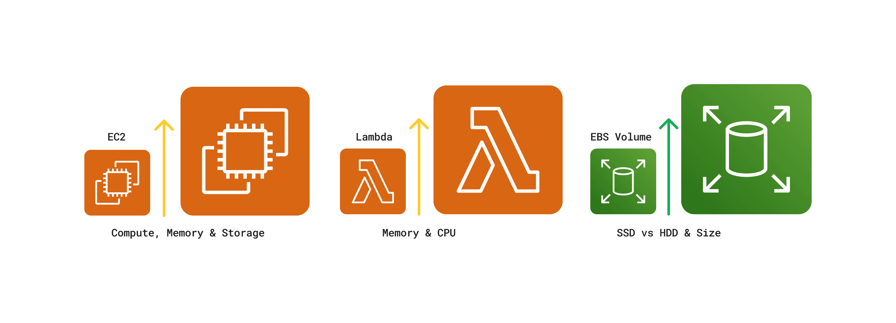

# Scaling Helios

As noted previously in the “Deploying ClickHouse” section, we decided to follow ClickHouses’ recommendation and host the ClickHouse database on one EC2 instance.

The chosen architecture presents several important trade-offs. By deploying everything on a single EC2 instance, we significantly reduce deployment complexity, avoiding the intricacies of managing multiple ClickHouse <TippyWrapper content="Per ClickHouse, “A shard is a subset of data. ClickHouse always has at least one shard for your data, so if you do not split the data across multiple servers, your data will be stored in one shard.”">shards</TippyWrapper>.

While this design simplifies management and reduces the cost of Clickhouse database hosting by following best practices, it does so at the expense of horizontal scalability and high availability options that a distributed setup might offer.

Vertical scaling, often referred to as "scaling up," involves increasing the resources (such as CPU, RAM, or storage) of existing services.

The diagram below illustrates three primary vertical scaling options available for the Helios architecture within the AWS ecosystem. These options focus on enhancing the capabilities of our existing EC2 instances, <TippyWrapper content="EBS is AWS's persistent storage for EC2 instances">Elastic Block Store (EBS)</TippyWrapper> volumes, and Lambda functions, allowing us to boost processing power and storage capacity without fundamentally altering our system's architecture. By leveraging these vertical scaling techniques, we can efficiently address growing workloads and ensure Helios continues to deliver solid performance as user needs evolve.

Understanding our system's limits is key to effective scaling. In this next section, we'll walk through our load testing process and system capabilities.
